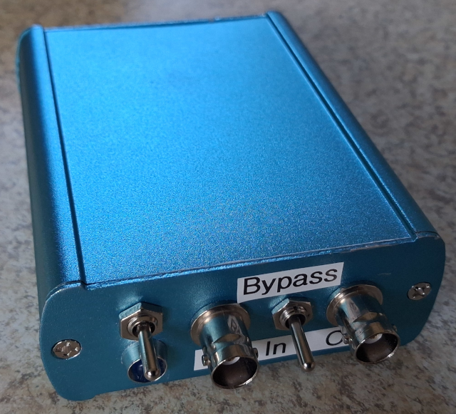
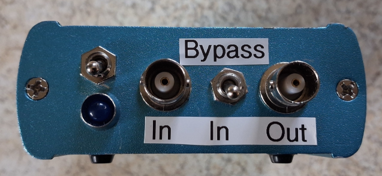
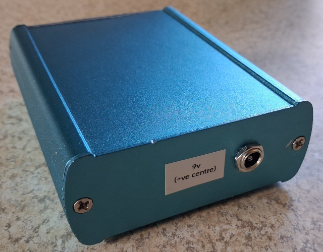
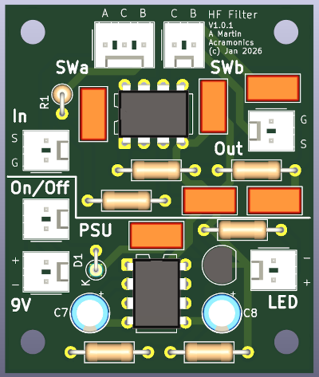
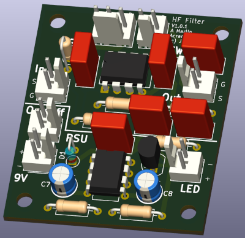

ScopeFilter
===========

Andrew Martin, Acramonics, January 2026
---------------------------------------

This ScopeFilter is designed for putting in front of an oscilloscope
when doing audio work where there is HF interference from computers,
etc. It is a simple Active Butterworth dual 2nd order filter with a
cutoff of 50kHz.

It is powered by a standard 9v wallwart with the power supply section
taken from the Elektor ESR meter giving positive and negative 4.5v
rails.

Filter component values are calculated from
https://www.changpuak.ch/electronics/Butterworth_Lowpass_active_24dB.php
and tweaked to standard values. As specified, the filter starts to cut
off at 40kHz.

The `LTSpice` directory contains an LTSpice simulation showing the
frequency response. The Kicad Spice simulator seems to have difficulty
with dual rail power supplies.

The `FrontPanelDesigner` directory contains a simple front panel
layout for use with a small aluminium case (W:3.25" H:1.25" x D:4").
The software is available from schaeffer-ag.de/en/front-panel-designer

I built the filter without Molex 254s for any of the wires except the
power input. This is the only one that comes from the back making it
convenient (with long enough wires) to be able to take off the front
panel (which is closely connected to the PCB) and unplug the power
from the board.

These images are generated by Kicad:

With the exception of the two 100nF caps, I also ended up building the
board with 5mm ceramic caps in place of the box film caps shown.
